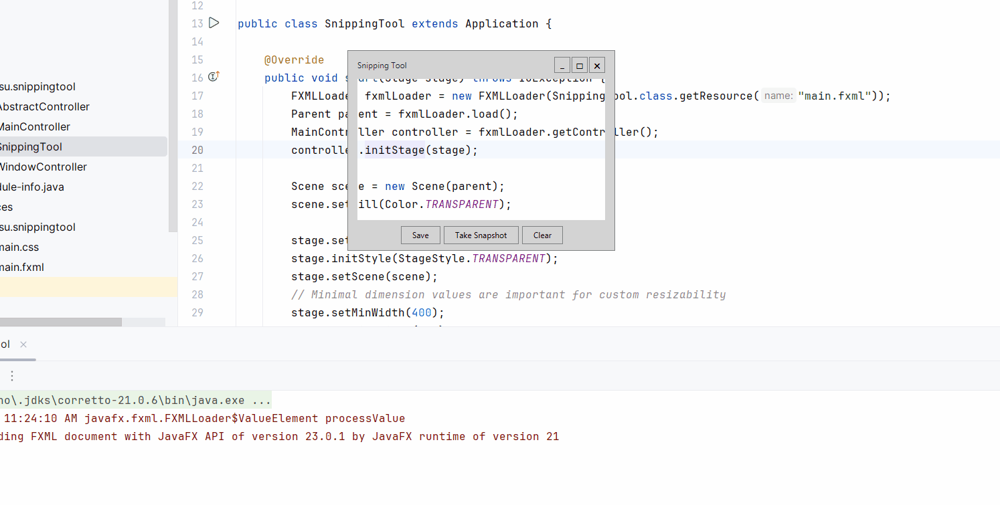

# Snipping Tool

A fake Snipping Tool written in Java using JavaFX library



# Release

```shell
gh release create v1.0.0 --notes "First release"
```

The workflow will automatically attach snipper.zip to the release.